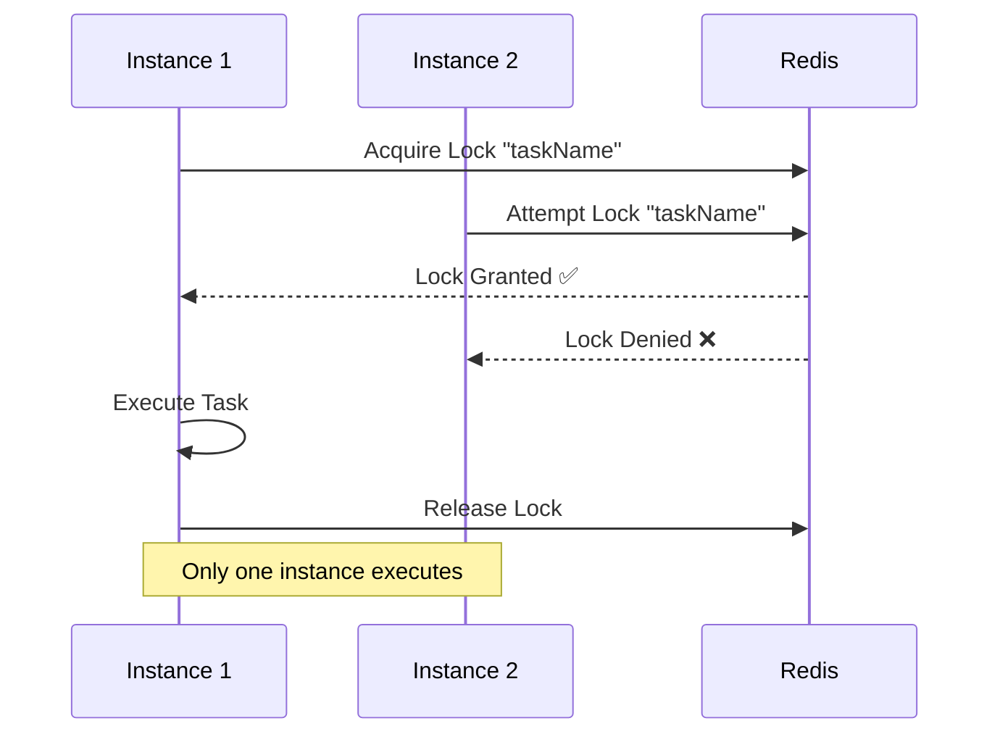
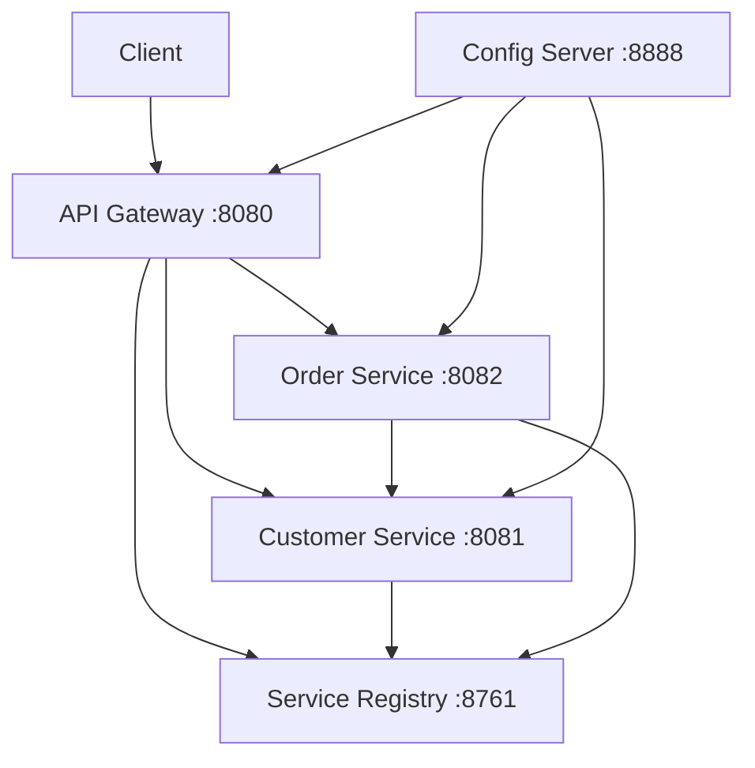

# 🧵 Java Learning - MultiThreading & Distributed Systems

[](https://www.oracle.com/java/)
[](https://spring.io/projects/spring-boot)
[](https://maven.apache.org/)
[](https://redis.io/)
[](https://docs.docker.com/compose/)

A comprehensive collection of Java projects demonstrating **advanced multithreading concepts**, **distributed systems patterns**, and **microservices architecture**. Built for learning enterprise-grade development patterns and showcasing production-ready implementations.

---

## 📁 **Project Portfolio**

### 🔄 **1. Redis Distributed Systems** 
**`redisDistrubutedSystems/`**

A production-ready demonstration of **distributed locking** using **ShedLock with Redis** to prevent duplicate scheduled task execution across multiple application instances.

#### **🎯 Key Features:**
- ✅ **ShedLock Integration**: Distributed locks with Redis backend
- ✅ **Multiple Lock Strategies**: Different task types with varying lock durations
- ✅ **Auto-Scaling Ready**: Works seamlessly with multiple instances
- ✅ **Monitoring Dashboard**: REST API endpoints for real-time observability
- ✅ **Docker Orchestration**: Complete multi-instance testing setup
- ✅ **Production Patterns**: Error handling, logging, and health checks

#### **🏗️ Architecture:**
```
┌─────────────┐    ┌─────────────┐    ┌─────────────┐
│ Instance-1  │    │ Instance-2  │    │ Instance-3  │
│   :8081     │    │   :8082     │    │   :8083     │
└──────┬──────┘    └──────┬──────┘    └──────┬──────┘
       │                  │                  │
       └──────────────────┼──────────────────┘
                          │
                    ┌─────▼─────┐
                    │   Redis   │
                    │ (ShedLock) │
                    └───────────┘
```

#### **🔧 Technology Stack:**
- **Framework**: Spring Boot 3.3.2, Spring Scheduling
- **Distributed Locking**: ShedLock 5.10.2 with Redis Provider
- **Database**: Redis 7.0+ (Lettuce client)
- **Containerization**: Docker & Docker Compose
- **Build Tool**: Maven with wrapper
- **Monitoring**: Custom REST APIs + Spring Actuator

---

### 🏗️ **2. Microservices Ecosystem**
**`Microservice/`**

A complete **microservices architecture** implementation showcasing service discovery, API gateway, configuration management, and inter-service communication patterns.

#### **🎯 Key Features:**
- ✅ **Service Discovery**: Eureka-based automatic service registration
- ✅ **API Gateway**: Centralized routing and load balancing
- ✅ **Config Management**: External configuration with Spring Cloud Config
- ✅ **Load Balancing**: Client-side and server-side load balancing
- ✅ **Fault Tolerance**: Circuit breaker patterns and retry mechanisms
- ✅ **Observability**: Centralized logging and health monitoring

#### **🏗️ Service Architecture:**
```
┌─────────────────┐    ┌─────────────────┐
│   API Gateway   │────│ Service Registry │
│     :8080       │    │ (Eureka) :8761  │
└─────────┬───────┘    └─────────────────┘
          │                      │
          │              ┌───────┴───────┐
          │              │               │
   ┌──────▼──────┐  ┌────▼────┐  ┌──────▼──────┐
   │ Customer    │  │ Order   │  │ Config      │
   │ Service     │  │ Service │  │ Server      │
   │   :8081     │  │  :8082  │  │   :8888     │
   └─────────────┘  └─────────┘  └─────────────┘
```

#### **📦 Services Overview:**

| Service | Port | Purpose | Key Features |
|---------|------|---------|--------------|
| **🌐 API Gateway** | 8080 | Route Management | Load balancing, Request routing |
| **📋 Service Registry** | 8761 | Service Discovery | Auto-registration, Health checks |
| **⚙️ Config Server** | 8888 | Configuration | Centralized config, Environment profiles |
| **👥 Customer Service** | 8081 | Customer Ops | CRUD operations, Data validation |
| **📦 Order Service** | 8082 | Order Processing | Business logic, Service integration |

#### **🔧 Technology Stack:**
- **Framework**: Spring Boot, Spring Cloud Gateway
- **Service Discovery**: Netflix Eureka
- **Configuration**: Spring Cloud Config Server
- **Communication**: REST APIs, OpenFeign clients
- **Build Tool**: Maven multi-module project

---

## 🚀 **Quick Start Guide**

### **Prerequisites**
```bash
# Required software versions
Java 21+
Maven 3.6+
Docker & Docker Compose
Redis 7.0+ (for distributed systems)
Git
```

### **🔄 Redis Distributed Systems**
```bash
# Navigate to project
cd redisDistrubutedSystems

# Start Redis
docker-compose up -d redis

# Run single instance
./mvnw spring-boot:run

# OR run multiple instances for testing
./scripts/start-demo.sh

# Test the system
./scripts/test-shedlock.sh
```

**Monitoring URLs:**
- Instance 1: http://localhost:8081/api/monitor/executions
- Instance 2: http://localhost:8082/api/monitor/locks
- Instance 3: http://localhost:8083/api/monitor/health

### **🏗️ Microservices Ecosystem**
```bash
# Navigate to project
cd Microservice

# Start all services in order
./start-all-services.sh

# OR manual startup (see manual-startup.md)
./start-services-simple.sh

# Test the ecosystem
./test-microservices.sh

# Stop all services
./stop-all-services.sh
```

**Service URLs:**
- API Gateway: http://localhost:8080
- Eureka Dashboard: http://localhost:8761
- Config Server: http://localhost:8888
- Customer Service: http://localhost:8081
- Order Service: http://localhost:8082

---

## 📚 **Learning Objectives & Concepts**

### **🎓 Distributed Systems Concepts**
- **Distributed Locking**: Preventing race conditions in scaled environments
- **Lock Strategies**: `lockAtMostFor`, `lockAtLeastFor` configurations
- **Fault Tolerance**: Auto-expiring locks and failure recovery
- **Monitoring**: Real-time observability of distributed operations
- **Scalability**: Horizontal scaling with coordinated task execution

### **🎓 Microservices Patterns**
- **Service Discovery**: Dynamic service registration and lookup
- **API Gateway**: Single entry point and cross-cutting concerns
- **Configuration Management**: Externalized configuration patterns
- **Circuit Breaker**: Fault isolation and cascading failure prevention
- **Load Balancing**: Distribution strategies and health checks

### **🎓 Production Readiness**
- **Container Orchestration**: Docker Compose for local development
- **Health Monitoring**: Custom health checks and metrics
- **Error Handling**: Graceful degradation and retry mechanisms
- **Logging Strategy**: Structured logging with correlation IDs
- **Testing Strategy**: Integration and system testing approaches

---

## 🎯 **Real-World Use Cases**

### **Redis Distributed Systems:**
- **Financial Services**: Daily settlement processing (prevents duplicate transactions)
- **E-commerce**: Abandoned cart email campaigns (avoids spam)
- **Healthcare**: Patient data synchronization (ensures consistency)
- **Logistics**: Inventory reconciliation (prevents stock discrepancies)

### **Microservices Architecture:**
- **E-commerce Platforms**: Service separation and scaling
- **Banking Systems**: Regulatory compliance and service isolation
- **SaaS Applications**: Multi-tenant architecture
- **Enterprise Integration**: Legacy system modernization

---

## 🔍 **Interview Ready Features**

### **Technical Depth:**
- ✅ **Distributed Systems**: Demonstrates understanding of CAP theorem, eventual consistency
- ✅ **Concurrency Control**: Shows expertise in distributed locking mechanisms
- ✅ **Architecture Patterns**: Microservices, API Gateway, Service Discovery
- ✅ **Production Concerns**: Monitoring, error handling, scalability

### **Practical Implementation:**
- ✅ **Working Code**: Fully functional, runnable demonstrations
- ✅ **Documentation**: Comprehensive setup and usage guides
- ✅ **Testing**: Automated scripts for validation
- ✅ **Monitoring**: Real-time observability dashboards

### **Problem Solving:**
- ✅ **Race Condition Prevention**: ShedLock implementation
- ✅ **Service Coordination**: Eureka service discovery
- ✅ **Configuration Management**: Spring Cloud Config
- ✅ **Fault Tolerance**: Circuit breaker and retry patterns

---

## 📊 **Project Metrics**

| Metric | Redis Distributed | Microservices | Combined |
|--------|------------------|---------------|----------|
| **Lines of Code** | ~2,000 | ~3,500 | ~5,500 |
| **Configuration Files** | 15+ | 25+ | 40+ |
| **Services/Components** | 4 tasks | 5 services | 9 total |
| **Testing Scripts** | 3 | 5 | 8 |
| **Documentation Pages** | 445 lines | 380 lines | 825+ lines |

---

## 🛠️ **Development Workflow**

### **Local Development:**
```bash
# Setup development environment
git clone <your-repo>
cd MultiThreading

# Redis Distributed Systems
cd redisDistrubutedSystems
docker-compose up -d redis
./mvnw spring-boot:run

# Microservices (in separate terminals)
cd ../Microservice
./start-all-services.sh
```

### **Testing:**
```bash
# Comprehensive system testing
cd redisDistrubutedSystems && ./scripts/test-shedlock.sh
cd ../Microservice && ./test-microservices.sh
```

### **Monitoring:**
```bash
# Watch real-time logs
tail -f redisDistrubutedSystems/logs/application.log
tail -f Microservice/logs/*.log
```

---

## 📖 **Additional Resources**

### **📁 Project Documentation:**
- [`redisDistrubutedSystems/README.md`](./redisDistrubutedSystems/README.md) - Complete ShedLock implementation guide
- [`Microservice/README.md`](./Microservice/README.md) - Microservices setup and usage
- [`Microservice/manual-startup.md`](./Microservice/manual-startup.md) - Step-by-step service startup

### **🔗 Technology References:**
- [ShedLock Documentation](https://github.com/lukas-krecan/ShedLock)
- [Spring Cloud Gateway](https://spring.io/projects/spring-cloud-gateway)
- [Netflix Eureka](https://github.com/Netflix/eureka)
- [Redis Documentation](https://redis.io/documentation)

---

## 🎨 **Architecture Diagrams**

### **Redis Distributed Locking Flow:**


### **Microservices Communication:**


---

## 🏆 **Key Achievements**

- ✅ **Zero Downtime**: Distributed locking prevents duplicate processing
- ✅ **High Availability**: Multiple instance support with automatic failover
- ✅ **Scalability**: Horizontal scaling without coordination issues
- ✅ **Observability**: Comprehensive monitoring and health checks
- ✅ **Production Ready**: Error handling, logging, and testing coverage

---

## 📝 **License**

This project is created for **educational purposes** and **portfolio demonstration**. Feel free to use as reference for learning distributed systems and microservices architecture.

---

**💼 Built by Umang | 📧 Connect for technical discussions**

*Demonstrating enterprise Java development patterns, distributed systems expertise, and production-ready implementation skills.* 