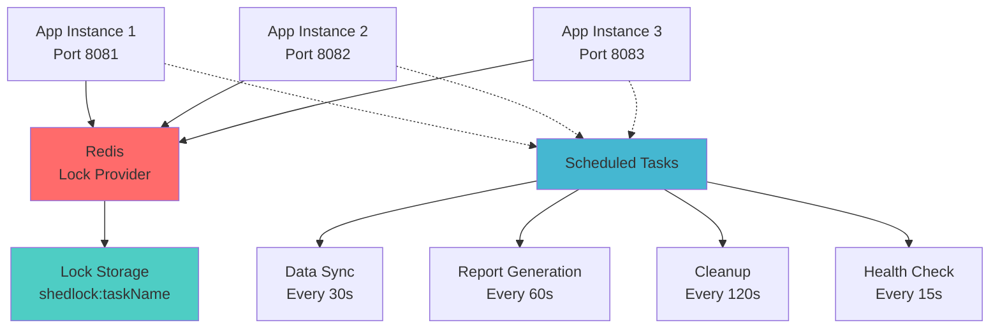

# ShedLock with Redis - Distributed Systems Demo

A comprehensive demonstration of **ShedLock** with **Redis** for ensuring singleton execution of scheduled tasks in distributed systems. This project showcases how to prevent duplicate processing when multiple application instances are running.

https://master-spring-ter.medium.com/ensuring-singleton-execution-in-distributed-systems-with-shedlock-and-redis-8d175b82d039

## 🎯 What is ShedLock?

ShedLock is a Java library that ensures your scheduled tasks are executed at most once at the same time across multiple instances of your application. It uses external stores (like Redis, MongoDB, JDBC) to coordinate locks between instances.

### Key Benefits:
- ✅ **Prevents duplicate execution** of scheduled tasks
- ✅ **Automatic lock cleanup** with TTL (Time To Live)
- ✅ **Minimal performance impact** with efficient locking
- ✅ **Fault tolerance** - locks expire automatically
- ✅ **Easy integration** with Spring Boot

## 🏗️ Architecture Overview



## 📋 Project Structure

```
redisDistrubutedSystems/
├── src/main/java/com/distributed/redisshedlockdemo/
│   ├── RedisShedlockDemoApplication.java    # Main Spring Boot application
│   ├── config/
│   │   ├── ShedLockConfig.java              # ShedLock configuration
│   │   └── RedisConfig.java                 # Redis configuration  
│   ├── service/
│   │   └── DataProcessingService.java       # Scheduled tasks with @SchedulerLock
│   └── controller/
│       └── MonitoringController.java        # REST API for monitoring
├── src/main/resources/
│   └── application.yml                      # Application configuration
├── docker-compose.yml                       # Multi-instance deployment
├── Dockerfile                               # Application container
├── scripts/
│   ├── start-demo.sh                        # Demo startup script
│   └── test-shedlock.sh                     # Comprehensive testing script
└── README.md                                # This file
```

## 🚀 Quick Start

### Prerequisites
- Docker & Docker Compose
- Java 21 (for local development)
- curl and jq (for testing scripts)

### 1. Start the Demo
```bash
# Make scripts executable
chmod +x scripts/*.sh

# Start all services (Redis + 3 app instances)
./scripts/start-demo.sh
```

### 2. Monitor the System
```bash
# Run comprehensive tests
./scripts/test-shedlock.sh

# Or check manually
curl http://localhost:8081/api/monitor/locks
curl http://localhost:8081/api/monitor/executions
```

### 3. View Real-time Logs
```bash
# Watch all instances
docker-compose logs -f

# Watch specific instance
docker-compose logs -f app-instance-1
```

## 🔧 Services & Endpoints

| Service | Port | Description |
|---------|------|-------------|
| App Instance 1 | 8081 | First application instance |
| App Instance 2 | 8082 | Second application instance |
| App Instance 3 | 8083 | Third application instance |
| Redis | 6379 | Lock provider and data store |
| Redis Commander | 8084 | Redis web UI for debugging |

### 📊 Monitoring API Endpoints

| Endpoint | Description |
|----------|-------------|
| `/api/monitor/health` | Application health and Redis connectivity |
| `/api/monitor/locks` | Current active ShedLock locks |
| `/api/monitor/executions` | Task execution history from all instances |
| `/api/monitor/redis-keys` | All Redis keys for debugging |
| `/api/monitor/task?taskName=X` | Specific task details and lock status |
| `/api/monitor/clear` | Clear execution history (for testing) |

## 📝 Scheduled Tasks Configuration

### 1. Data Synchronization Task
```java
@Scheduled(fixedRate = 30000) // Every 30 seconds
@SchedulerLock(name = "dataSyncTask", 
               lockAtMostFor = "25s", 
               lockAtLeastFor = "5s")
public void synchronizeData()
```
- **Purpose**: Critical data sync that must run only once
- **Frequency**: Every 30 seconds
- **Lock Duration**: Maximum 25 seconds, minimum 5 seconds
- **Use Case**: Database synchronization, file processing

### 2. Daily Report Generation
```java
@Scheduled(fixedRate = 60000) // Every minute (demo frequency)
@SchedulerLock(name = "dailyReportGeneration", 
               lockAtMostFor = "2m", 
               lockAtLeastFor = "30s")
public void generateDailyReport()
```
- **Purpose**: Resource-intensive report generation
- **Frequency**: Every minute (daily in production)
- **Lock Duration**: Maximum 2 minutes, minimum 30 seconds
- **Use Case**: Business reports, analytics processing

### 3. Cleanup Operations
```java
@Scheduled(fixedRate = 120000) // Every 2 minutes  
@SchedulerLock(name = "cleanupTask", 
               lockAtMostFor = "1m", 
               lockAtLeastFor = "10s")
public void performCleanup()
```
- **Purpose**: Cleanup old data and temporary files
- **Frequency**: Every 2 minutes
- **Lock Duration**: Maximum 1 minute, minimum 10 seconds
- **Use Case**: Cache cleanup, log rotation

### 4. Health Checks
```java
@Scheduled(fixedRate = 15000) // Every 15 seconds
@SchedulerLock(name = "healthCheck", 
               lockAtMostFor = "10s", 
               lockAtLeastFor = "2s")
public void performHealthCheck()
```
- **Purpose**: System health monitoring
- **Frequency**: Every 15 seconds
- **Lock Duration**: Maximum 10 seconds, minimum 2 seconds
- **Use Case**: Service monitoring, alerting

## 🔍 Understanding ShedLock Parameters

### `lockAtMostFor`
- **Maximum time** the lock is held
- Prevents **deadlocks** if application crashes
- Lock **automatically expires** after this duration
- Choose based on **maximum expected execution time**

### `lockAtLeastFor`  
- **Minimum time** the lock is held
- Prevents **too frequent executions**
- Useful when task execution time varies
- Ensures **consistent intervals** between executions

### `name`
- **Unique identifier** for the lock
- Same name = same lock across all instances
- Different names = independent locks
- Should be **descriptive** and **unique**

## 🧪 Testing Scenarios

### 1. Basic Lock Verification
```bash
# Check active locks
curl http://localhost:8081/api/monitor/locks | jq '.active_locks'

# Expected: Only one instance should have active locks for each task
```

### 2. Execution History Analysis
```bash
# Get execution history from all instances
for port in 8081 8082 8083; do
  echo "Instance $port:"
  curl -s http://localhost:$port/api/monitor/executions | jq '.data_sync_executions[0:3]'
done

# Expected: Each instance shows executions, but no time overlap
```

### 3. Real-time Monitoring
```bash
# Monitor locks in real-time (30 seconds)
./scripts/test-shedlock.sh
# Choose option 1 for real-time monitoring

# Expected: Locks appear and disappear as tasks execute
```

### 4. Stress Testing
```bash
# Clear data and monitor fresh
curl http://localhost:8081/api/monitor/clear
./scripts/test-shedlock.sh
# Choose option 4 for comprehensive testing

# Expected: Only one execution per task despite multiple instances
```

## 📊 Redis Lock Storage

ShedLock stores locks in Redis with the following pattern:

### Lock Key Format
```
shedlock:{taskName}
```

### Lock Value Structure
```json
{
  "lockUntil": "2024-01-15T10:30:00Z",
  "lockedAt": "2024-01-15T10:29:30Z", 
  "lockedBy": "instance-1"
}
```

### TTL (Time To Live)
- Automatically set based on `lockAtMostFor`
- Prevents orphaned locks from crashed instances
- Redis handles cleanup automatically

## 🔧 Configuration Deep Dive

### ShedLock Configuration
```java
@Configuration
@EnableSchedulerLock(defaultLockAtMostFor = "10m")
public class ShedLockConfig {
    
    @Bean
    public LockProvider lockProvider(RedisConnectionFactory connectionFactory) {
        return new RedisLockProvider(connectionFactory, "shedlock");
    }
}
```

### Redis Configuration
```yaml
spring:
  data:
    redis:
      host: ${REDIS_HOST:localhost}
      port: ${REDIS_PORT:6379}
      timeout: 2000ms
      lettuce:
        pool:
          max-active: 8
          max-idle: 8
```

### Application Configuration
```yaml
app:
  instance:
    id: ${INSTANCE_ID:instance-1}
  scheduling:
    enabled: true

logging:
  level:
    net.javacrumbs.shedlock: DEBUG
```

## 🐛 Troubleshooting

### Common Issues

#### 1. All instances executing the same task
**Symptoms**: Multiple instances show execution logs for the same task at the same time
**Causes**: 
- ShedLock not configured properly
- Redis connection issues
- Missing `@EnableSchedulerLock` annotation

**Solutions**:
```bash
# Check Redis connectivity
curl http://localhost:8081/api/monitor/health

# Check ShedLock configuration
docker-compose logs app-instance-1 | grep -i shedlock

# Verify locks are being created
curl http://localhost:8081/api/monitor/redis-keys
```

#### 2. Tasks not executing at all
**Symptoms**: No execution logs from any instance
**Causes**:
- Redis down or unreachable
- Application not starting
- Scheduling disabled

**Solutions**:
```bash
# Check service health
docker-compose ps

# Check application logs
docker-compose logs -f app-instance-1

# Restart services
docker-compose down && docker-compose up -d
```

#### 3. Locks never releasing
**Symptoms**: Locks visible in Redis but never clearing
**Causes**:
- `lockAtMostFor` too large
- Redis TTL not set properly
- Application hanging

**Solutions**:
```bash
# Check lock TTL
redis-cli -h localhost -p 6379 TTL "shedlock:taskName"

# Clear stuck locks manually
redis-cli -h localhost -p 6379 DEL "shedlock:taskName"

# Restart application instances
docker-compose restart app-instance-1
```

### Debugging Commands

```bash
# View Redis locks directly
redis-cli -h localhost -p 6379 KEYS "shedlock:*"

# Check lock details
redis-cli -h localhost -p 6379 GET "shedlock:dataSyncTask"

# Monitor Redis operations
redis-cli -h localhost -p 6379 MONITOR

# Check application health
curl http://localhost:8081/actuator/health

# View scheduled tasks
curl http://localhost:8081/actuator/scheduledtasks
```

## 🎯 Key Learning Points

### 1. **Single Execution Guarantee**
- Only **one instance** executes each scheduled task
- Other instances **skip execution** when lock is held
- Ensures **data consistency** and prevents duplicate processing

### 2. **Automatic Cleanup**
- Locks **expire automatically** based on TTL
- No manual intervention needed
- Handles **crashed instances** gracefully

### 3. **Performance Impact**
- **Minimal overhead** - just a Redis check before execution
- **Fast lock acquisition** (milliseconds)
- **No impact** on application startup or shutdown

### 4. **Fault Tolerance**
- **Redis down**: Tasks execute on all instances (degraded mode)
- **Instance crash**: Locks expire and other instances take over
- **Network issues**: Automatic retry and failover

## 🚀 Production Considerations

### 1. **Lock Duration Tuning**
```java
// Conservative approach - longer locks
@SchedulerLock(lockAtMostFor = "30m", lockAtLeastFor = "1m")

// Aggressive approach - shorter locks  
@SchedulerLock(lockAtMostFor = "2m", lockAtLeastFor = "30s")
```

### 2. **Redis High Availability**
- Use **Redis Cluster** or **Redis Sentinel**
- Configure **connection pooling**
- Monitor **Redis performance** and memory usage

### 3. **Monitoring & Alerting**
- Track **lock acquisition failures**
- Monitor **task execution frequency**
- Alert on **missing task executions**

### 4. **Testing Strategy**
- **Unit tests** for individual tasks
- **Integration tests** with ShedLock
- **Load testing** with multiple instances

## 📚 Additional Resources

- [ShedLock Official Documentation](https://github.com/lukas-krecan/ShedLock)
- [Spring Boot Scheduling Guide](https://spring.io/guides/gs/scheduling-tasks/)
- [Redis Documentation](https://redis.io/documentation)
- [Distributed Systems Patterns](https://microservices.io/patterns/)

## 🤝 Contributing

1. Fork the repository
2. Create a feature branch
3. Add tests for new functionality
4. Submit a pull request

## 📄 License

This project is licensed under the MIT License - see the LICENSE file for details.

---

**Happy distributed scheduling! 🎉** 